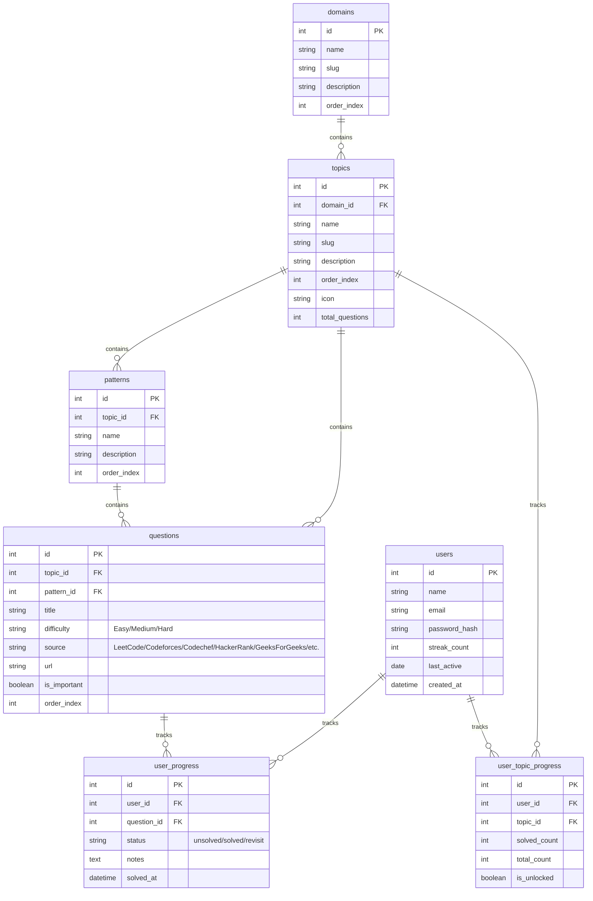
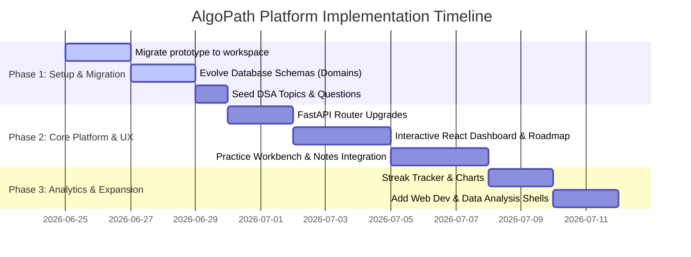

# AlgoPath: DSA & Multi-Domain Learning Platform Blueprint

This document contains a comprehensive plan for building **AlgoPath**, an upgraded, personalized study planning platform (similar to Striver's Sheet but upgraded to support multiple domains, progress tracking, and smart roadmaps). It outlines the architecture, database schema, required resources, and a copy-pasteable structured prompt for vibe-coding platforms like **Antigravity**.

---

## 1. Project Overview & Architectural Plan

To support multiple domains (DSA, Web Development, Data Analysis) while focusing on **DSA first**, we need a modular architecture. We can extend the existing database schema to group topics by a top-level **Domain** entity. 

### Database Schema (Extended for Multi-Domain Support)
Below is the evolved relational database schema. We introduce a `domains` table and link `topics` to it.



### Technical Stack Recommendation
*   **Frontend**: React 18, Vite, Tailwind CSS (sleek dark mode, glassmorphism UI, transitions), Lucide React (for icons), React Router DOM (routing).
*   **Backend**: FastAPI (Python) - lightweight, fast, auto-generates interactive Swagger documentation.
*   **Database**: SQLite for local prototype, migrating to MySQL/PostgreSQL for production.
*   **ORM**: SQLAlchemy with Alembic migrations.

---

## 2. Resources Needed for the Vibe Coding Agent

To successfully guide a vibe coding agent to build the platform, you must provide it with the following core files and schemas:

1.  **Database DDL (`schema.sql`)**: Defines the tables and constraints.
2.  **API Contract Spec (`openapi.json` or markdown)**: Outlines the route parameters, request payloads, and response structures.
3.  **Topic & Question Seeding Script (`seed.py`)**: A comprehensive dataset containing topics, patterns, and source links. A highly structured dataset is provided in Section 4.
4.  **UI/UX Layout Specification**: Describes the visual hierarchy, colors, and layout pages.

---

## 3. Structured Prompt for Vibe Coding (Antigravity Prompt)

Copy and paste the structured prompt below to launch a vibe-coding session in **Antigravity**. It references the existing prototype in your scratch space (`c:\Users\pottu\.gemini\antigravity-ide\scratch\algopath`) and instructs the agent to move and expand it.

```markdown
Role: Premium Fullstack Engineer & Designer
Task: Implement the "AlgoPath" Multi-Domain Study Planner, focusing on Phase 1 (DSA roadmap) first.

Context:
- We have an existing backend/frontend prototype structure in `c:\Users\pottu\.gemini\antigravity-ide\scratch\algopath`.
- The backend is written in FastAPI, using SQLAlchemy with MySQL (or SQLite fallback).
- The frontend is React 18 (Vite, Tailwind CSS, Lucide icons).
- We want to migrate this codebase to our working folder `d:\Projects\Antigravity\project 1\project 1.1`, refactor it to support multiple domains (beginning with DSA), and style it with a highly premium, modern, glassmorphic dark-theme UI.

Core Requirements:

1. Database Evolution (Multi-Domain Schema):
   - Adapt the database tables in `backend/models.py` and `schema.sql` to support a new top-level `domains` table (`id`, `name`, `slug`, `description`, `order_index`).
   - Add `domain_id` column to the `topics` table.
   - Update `seed.py` to seed a "Data Structures & Algorithms" domain first, and link all existing topics (Arrays, Strings, Trees, etc.) to it.

2. Backend API Extensions (`backend/routes/`):
   - Add endpoints:
     - `GET /api/domains` to list all learning tracks.
     - `GET /api/domains/{domain_slug}/roadmap` to return topics linked to that domain along with the logged-in user's progress.
   - Update user progress endpoints:
     - Solve tracking, notes saving (autosave with debounce support), must-visit bookmarks.
     - Automatically compute the user's daily practice streak. A streak increases if the user solves at least one question on consecutive calendar days.

3. Premium UI & Domain Select Dashboard (`frontend/src/`):
   - **Domain Selector**: A stunning landing page showing available tracks:
     - "Data Structures & Algorithms" (Active)
     - "Web Development" (Coming Soon - locked card)
     - "Data Analysis" (Coming Soon - locked card)
   - **Interactive Roadmap View**: Instead of a simple list, build a vertical or horizontal node graph flowchart representing topics (e.g., Arrays -> Strings -> Hashing -> Two Pointers -> ... -> Trees -> Graphs -> DP).
     - Color nodes based on status: Completed (Green Glow), In Progress (Indigo Pulse), Locked (Muted Gray with Lock icon).
     - Unlocking Logic: A topic unlocks only if the preceding topic is at least 30% completed.
   - **Practice Workbench**:
     - Left Panel: List of patterns for the active topic (e.g., Prefix Sum, Kadane). Clicking a pattern filters the questions in the middle panel.
     - Middle Panel: Question table displaying Title, Difficulty tag, Source logo/badge (LeetCode, Codeforces, HackerRank, etc.), external URL link, a bookmark/revisit star, and a checkmark status.
     - Right Panel: Notes workspace with a beautiful Markdown Editor and autosave indicators.
   - **Aesthetics & Styling**:
     - Dark-mode first: Background `#030712` (Slate-950) with subtle grid gradients.
     - Cards: Glassmorphic borders (`backdrop-blur-md bg-white/5 border border-white/10`).
     - Micro-animations: Smooth transitions on hovering cards, scale animations, active pulsers.

4. Implementation Instructions:
   - Copy the files from `c:\Users\pottu\.gemini\antigravity-ide\scratch\algopath` to `d:\Projects\Antigravity\project 1\project 1.1` as the starting point.
   - Refactor both backend and frontend to reflect the domain changes.
   - Run local validation to ensure API routes respond correctly and the Vite development server boots.
```

---

## 4. Phase 1: Structured DSA Seeding Dataset

Below is the structured data configuration to seed the DSA domain. It includes topics, sub-patterns, and direct question links from LeetCode, Codeforces, HackerRank, and GeeksForGeeks. This matches the structures required by `seed.py`.

```json
{
  "domain": {
    "name": "Data Structures & Algorithms",
    "slug": "dsa",
    "description": "Master coding patterns, algorithms, and complexity analysis from Arrays to Graphs."
  },
  "topics": [
    {
      "name": "Arrays",
      "slug": "arrays",
      "icon": "Grid",
      "order_index": 1,
      "patterns": [
        {
          "name": "Prefix Sum",
          "questions": [
            {
              "title": "Range Sum Query - Immutable",
              "difficulty": "Easy",
              "source": "LeetCode",
              "url": "https://leetcode.com/problems/range-sum-query-immutable/",
              "is_important": true
            },
            {
              "title": "Subarray Sum Equals K",
              "difficulty": "Medium",
              "source": "LeetCode",
              "url": "https://leetcode.com/problems/subarray-sum-equals-k/",
              "is_important": true
            }
          ]
        },
        {
          "name": "Kadane's Algorithm",
          "questions": [
            {
              "title": "Maximum Subarray",
              "difficulty": "Medium",
              "source": "LeetCode",
              "url": "https://leetcode.com/problems/maximum-subarray/",
              "is_important": true
            },
            {
              "title": "Maximum Sum Circular Subarray",
              "difficulty": "Medium",
              "source": "LeetCode",
              "url": "https://leetcode.com/problems/maximum-sum-circular-subarray/",
              "is_important": false
            }
          ]
        }
      ]
    },
    {
      "name": "Two Pointers",
      "slug": "two-pointers",
      "icon": "ArrowLeftRight",
      "order_index": 2,
      "patterns": [
        {
          "name": "Opposite Directions",
          "questions": [
            {
              "title": "Two Sum II - Input Array Is Sorted",
              "difficulty": "Easy",
              "source": "LeetCode",
              "url": "https://leetcode.com/problems/two-sum-ii-input-array-is-sorted/",
              "is_important": true
            },
            {
              "title": "3Sum",
              "difficulty": "Medium",
              "source": "LeetCode",
              "url": "https://leetcode.com/problems/3sum/",
              "is_important": true
            }
          ]
        }
      ]
    },
    {
      "name": "Trees",
      "slug": "trees",
      "icon": "GitBranch",
      "order_index": 3,
      "patterns": [
        {
          "name": "DFS Traversal",
          "questions": [
            {
              "title": "Maximum Depth of Binary Tree",
              "difficulty": "Easy",
              "source": "LeetCode",
              "url": "https://leetcode.com/problems/maximum-depth-of-binary-tree/",
              "is_important": true
            },
            {
              "title": "Invert Binary Tree",
              "difficulty": "Easy",
              "source": "LeetCode",
              "url": "https://leetcode.com/problems/invert-binary-tree/",
              "is_important": true
            }
          ]
        }
      ]
    }
  ]
}
```

---

## 5. Success Path & Phased Timeline

To ensure the success of this project, you should execute it in three distinct phases:



### Key Metrics for Launch
1.  **UX Smoothness**: Notes autosave debouncing is silent and doesn't interrupt typing.
2.  **State Retention**: Changing tabs or topics does not clear typed notes or search filters.
3.  **Roadmap Gamification**: Lock/unlock thresholds (e.g. 30% completion) dynamically refresh and lock next items.
