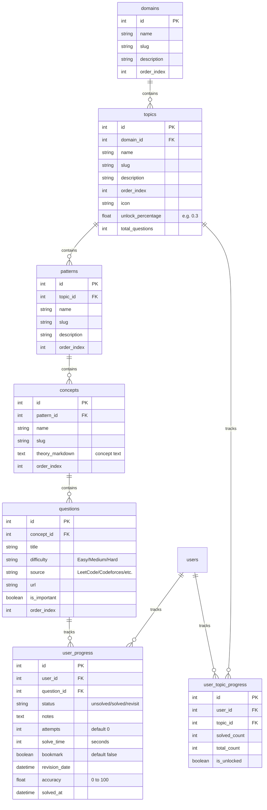

# Revised Implementation Plan - AlgoPath Multi-Domain Learning Platform

This document describes the updated plans for building **AlgoPath** as a fully data-driven, hierarchical learning platform (supporting Domain $\rightarrow$ Topic $\rightarrow$ Pattern $\rightarrow$ Concept $\rightarrow$ Question) with extended progress metrics and a structured, modular backend repository architecture.

---

## Goal Description

Build AlgoPath in the workspace `d:\Projects\Antigravity\project 1\project 1.1`. The application will support a nested learning hierarchy and detailed user analytics (solve times, accuracy, attempts, bookmarks, and revision schedules). The curriculum structure is entirely data-driven, defined in an external JSON file (`seed_data.json`), and loaded dynamically.

---

## User Review Required

> [!IMPORTANT]
> **Data-Driven Seeding**: Python code will not contain hardcoded curriculums. The database seeder will load `seed_data.json` which specifies domains, topics (with icons and custom `unlock_percentage`), patterns, concepts, and questions.
> 
> **Concept-First Learning**: The UI will introduce a tab or section for **Concepts** (theory/explanations) before showing code problems, helping students grasp the patterns first.
> 
> **Architecture**:
> - **Backend**: Organised under `backend/app/` into folders: `models/`, `schemas/`, `repositories/`, `services/`, `routes/`.
> - **Database**: Uses SQLAlchemy. Works with PostgreSQL (prod) and SQLite (dev).
> - **Frontend**: Clean TypeScript-based Vite project.

---

## Evolved Hierarchy & Database Models

The relational schema is updated to support the new hierarchy and detailed progress fields.



---

## Proposed Changes

### Backend Layout (`backend/app/`)

- `models/`:
  - `user.py`, `domain.py`, `topic.py`, `pattern.py`, `concept.py`, `question.py`, `progress.py`
- `schemas/`:
  - `user.py`, `domain.py`, `topic.py`, `pattern.py`, `concept.py`, `question.py`, `progress.py` (Pydantic models)
- `repositories/`:
  - `base.py` (generic CRUD repo)
  - `user.py`, `domain.py`, `topic.py`, `progress.py` (encapsulating SQL queries)
- `services/`:
  - `auth_service.py` (passwords, tokens, JWT)
  - `progress_service.py` (streak calculations, unlocking, score updates)
  - `seeding_service.py` (seeding database from external JSON)
- `routes/`:
  - `auth.py`, `domains.py`, `progress.py`, `admin.py` (restricting management tools to `is_admin == True`)
- `database.py` (SQLAlchemy setup)
- `main.py` (FastAPI app)

### Curriculum JSON (`backend/seed_data.json`)
Contains the structural roadmap configuration. See the initial schema below:
```json
{
  "domains": [
    {
      "name": "Data Structures & Algorithms",
      "slug": "dsa",
      "description": "Master DSA via coding patterns and core computer science concepts.",
      "order_index": 1,
      "topics": [
        {
          "name": "Arrays",
          "slug": "arrays",
          "description": "Master prefix sums, sliding windows, and linear data representations.",
          "order_index": 1,
          "icon": "Grid",
          "unlock_percentage": 0.3,
          "patterns": [
            {
              "name": "Prefix Sum",
              "slug": "prefix-sum",
              "description": "Precompute cumulative sums to answer range query problems in O(1) time.",
              "order_index": 1,
              "concepts": [
                {
                  "name": "1D Prefix Sum Basics",
                  "slug": "1d-prefix-sum-basics",
                  "theory_markdown": "# 1D Prefix Sum\nGiven an array `arr`, the prefix sum array `P` is defined as `P[i] = P[i-1] + arr[i]`. This enables range queries in `O(1)`.",
                  "order_index": 1,
                  "questions": [
                    {
                      "title": "Range Sum Query - Immutable",
                      "difficulty": "Easy",
                      "source": "LeetCode",
                      "url": "https://leetcode.com/problems/range-sum-query-immutable/",
                      "is_important": true,
                      "order_index": 1
                    }
                  ]
                }
              ]
            }
          ]
        }
      ]
    }
  ]
}
```

---

## Verification Plan

### Automated Verification
- Verify JSON parsing of the seed file.
- Validate JWT verification unit tests.

### Manual Verification
1. Run the database seed: `python -m backend.app.seed` and verify database tables are seeded from the JSON file.
2. Sign in as admin, navigate to `/admin` to verify CRUD screens for Domains, Topics, Patterns, Concepts, and Questions.
3. Solve a question inside a Concept, verify that `solve_time`, `attempts`, `accuracy`, and `bookmark` update in SQL correctly.
4. Verify dynamic unlocking of the next Topic once the previous topic's solved count reaches its configured `unlock_percentage` (e.g. 30%).
