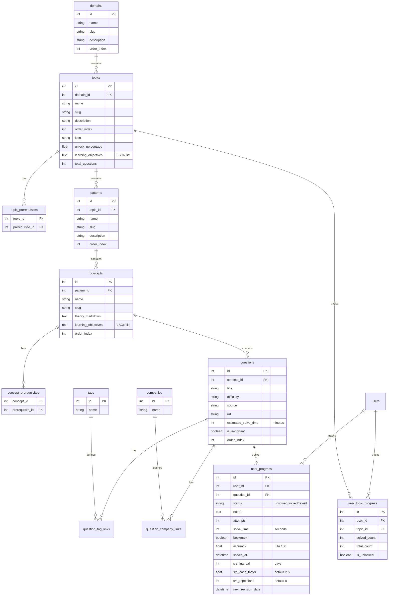

# Production Implementation Plan - AlgoPath

This is the finalized plan for **AlgoPath**, an upgraded online study planner. The system uses a data-driven hierarchy (Domain $\rightarrow$ Topic $\rightarrow$ Pattern $\rightarrow$ Concept $\rightarrow$ Question), incorporates SM-2 Spaced Repetition, generates daily study plans matching user availability, and logs detailed pattern-level mastery analytics.

---

## Goal Description

Build the AlgoPath platform inside the workspace `d:\Projects\Antigravity\project 1\project 1.1` with a PostgreSQL-compatible, SQLite-fallback database, a FastAPI backend structured in services and repositories, and a modular React+TypeScript frontend.

---

## User Review Required

> [!IMPORTANT]
> **Data Seed Schema**: Seeding uses a unified `seed_data.json` file. This schema includes prerequisites (by slug), tags, companies, estimated solve times, and learning objectives.
> 
> **SM-2 Algorithm (Spaced Repetition)**:
> When completing/revising a question, users rate their recall quality $q \in [0, 5]$:
> - $q \ge 3$: Success. Increment repetitions, update interval:
>   - Reps = 1: Interval = 1 day
>   - Reps = 2: Interval = 6 days
>   - Reps > 2: Interval = Interval * EF (Ease Factor)
> - $q < 3$: Fail. Reset repetitions to 0, Interval = 1 day.
> - EF is updated: $EF' = EF + (0.1 - (5 - q) * (0.08 + (5 - q) * 0.02))$. Min EF = 1.3.
> 
> **Study Planner Logic**:
> - User provides available hours per day (converted to minutes).
> - System assigns **Revision Items** (due questions according to SM-2 next revision date) first.
> - System fills remaining time budget with **New Learning Items** (questions in unlocked concepts/topics following the roadmap order and prerequisites, using `estimated_solve_time`).
> 
> **Pattern Mastery calculation**:
> Mastery \% = $\left(\frac{\text{Solved Questions}}{\text{Total Questions}}\right) \times \text{Avg Accuracy} \times 100$ per pattern.

---

## Evolved Hierarchy & Database Models

---

## Proposed Changes

### Backend Subdirectory Layout (`backend/app/`)
- `models/`: Models for User, Domain, Topic, TopicPrerequisite, Pattern, Concept, ConceptPrerequisite, Question, Tag, Company, UserProgress, UserTopicProgress.
- `schemas/`: Pydantic input/output schemas including validation schemas.
- `repositories/`:
  - `user_repo.py`, `domain_repo.py`, `topic_repo.py`, `pattern_repo.py`, `concept_repo.py`, `question_repo.py`, `progress_repo.py`.
- `services/`:
  - `auth_service.py` (JWT & Auth)
  - `seeding_service.py` (loads `seed_data.json` with prerequisites & tags mapping)
  - `srs_service.py` (SM-2 calculations)
  - `planner_service.py` (daily scheduler based on available minutes, revisions, roadmap status)
  - `analytics_service.py` (mastery % and difficulty distribution)
- `routes/`:
  - `auth.py`, `domains.py`, `progress.py`, `planner.py`, `admin.py`.
- `database.py`, `main.py`.

### Frontend Components (`frontend/src/`)
- `context/AuthContext.tsx`
- `pages/DomainSelection.tsx` (Select active learning track)
- `pages/Dashboard.tsx` (Interactive Node Graph roadmap, Streak meter, **Pattern Mastery Analytics** cards showing details of Prefix Sum, Binary Search, etc.)
- `pages/Planner.tsx` (Input daily availability in hours/minutes, display daily schedule of revision items and new items)
- `pages/TopicPage.tsx` (Topic drill-down containing Concepts slides, question tables, bookmarks toggler, rating slider 0-5 for SM-2 feedback, Markdown notes)
- `pages/AdminPanel.tsx` (Secured dashboard to CRUD syllabus metadata)

---

## Verification Plan

### Automated Tests
- Test SM-2 scheduling edge cases (success rating 4 vs fail rating 1).
- Test dynamic scheduler output matching user minutes budget.

### Manual Verification
1. Run `python -m backend.app.seed` to seed `seed_data.json` (complete with tags, estimated solve times, and company keywords).
2. Register an account, log in, select the DSA domain.
3. Open a Concept, read the markdown theory, complete a question, rate it a "3" or "4", and verify that it schedules a revision in 1 day or 6 days.
4. Input available time of 45 minutes on the Planner page, and verify the schedule selects due revisions first and fits new questions underneath the time budget.
5. Visit the dashboard to inspect the Concept/Pattern mastery widgets.
